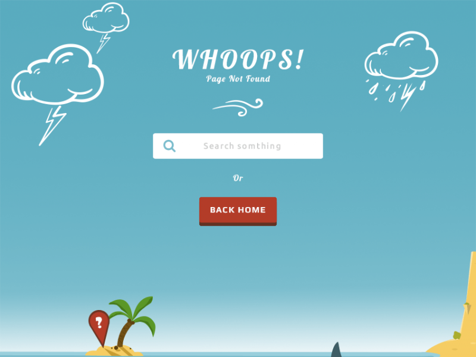

## template-island-creative-404

> Archived and copied from the [Island - Creative 404 page](https://themehunt.com/item/1525070-island-creative-404-page) by [MH Rafi](https://themehunt.com/profile/MH%20Rafi) on themehunt.com.  
> This codebase is meant to be used for CSS and web design reference and study purposes only.

### Content

- [Content](#content)
- [Dependencies](#dependencies)
- [Installation](#installation)
- [Usage](#usage)
- [References](#references)

### Dependencies

The following dependecies are used for this project. Feel free to experiment using other dependencies and versions.

1. Windows 64-bit OS
2. NodeJS
	- node version 12.16.3
	- npm version 6.14.4
3. NodeJS modules (installed via npm)
	- gulp v.4.0.2
	- browser-sync v.2.26.7

## Installation

1. Clone this repository.  
`https://github.com/arcsource/template-island-creative.git`

2. Install dependencies.  
`npm install`

## Usage

1. Run the localhost static website development environment.  
`npm run dev`

2.  Edit the existing static files from the **./public** directory and wait for live reload. Your updates will reflect on the web browser.

3. To include new static website files on live reload:
	- Stop the localhost **dev** server.
	- Create your new static (.html, .js, .css) files inside the **./public** directory.
	- Re-start the **dev** server.  
`npm run dev`

4. Run the production static website (does not use live reload).  
`npm run start`

## References

[[1]](https://github.com/ciatph/webtools) - live reload using gulp v.3.9.1 (older gulp version)  
[[2]](https://trello.com/c/gFN68i6k) - gulp notes (trello)

@weaponsforge  
20211101